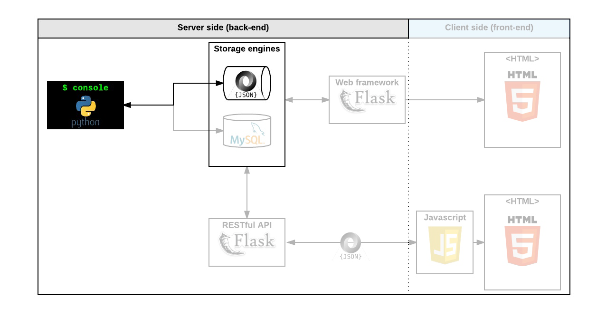

# AirBnB Clone - The Console

## Table of Contents
- [Description](#description)
- [Command Interpreter](#command-interpreter)
  - [How to Start](#how-to-start)
  - [How to Use](#how-to-use)
  - [Examples](#examples)
- [Project Structure](#project-structure)
- [Authors](#authors)
- [License](#license)



## Description
Welcome to the AirBnB clone project! This project is the first step towards building a comprehensive web application for managing AirBnB-like listings. The primary objective of this stage is to develop a command interpreter to manage AirBnB objects. This interpreter will facilitate the creation, retrieval, updating, and deletion of various objects such as users, places, cities, and more.

## Command Interpreter
The command interpreter functions similarly to a shell but is tailored to manage AirBnB objects. It allows users to execute commands in both interactive and non-interactive modes to manipulate the objects' data.

### How to Start
To start the command interpreter in interactive mode, execute the following command:
```bash
$ ./console.py
```

To use the command interpreter in non-interactive mode, you can pipe commands into it, for example:
```bash
$ echo "help" | ./console.py
```

### How to Use
Once the command interpreter is running, you can use the following commands to interact with the objects:

- `create <ClassName>`: Creates a new instance of the specified class.
- `show <ClassName> <id>`: Displays the string representation of an instance based on its class name and id.
- `destroy <ClassName> <id>`: Deletes an instance based on its class name and id.
- `all <ClassName>`: Displays all instances of the specified class.
- `update <ClassName> <id> <attribute name> <attribute value>`: Updates an instance by adding or updating an attribute.

### Examples
Interactive mode:
```bash
$ ./console.py
(hbnb) create User
(hbnb) show User 1234-1234-1234
(hbnb) destroy User 1234-1234-1234
(hbnb) all User
(hbnb) update User 1234-1234-1234 name "John Doe"
(hbnb) quit
```

Non-interactive mode:
```bash
$ echo "create User" | ./console.py
$ echo "show User 1234-1234-1234" | ./console.py
$ echo "all User" | ./console.py
```

## Project Structure
The project consists of the following key components:
.
├── AUTHORS
├── consept_image.png
├── console.py
├── file.json
├── hbnb_logo.png
├── LICENSE
├── models
│   ├── amenity.py
│   ├── base_model.py
│   ├── city.py
│   ├── engine
│   │   ├── file.json
│   │   ├── file_storage.py
│   │   ├── __init__.py
│   │   └── __pycache__
│   │       ├── file_storage.cpython-38.pyc
│   │       └── __init__.cpython-38.pyc
│   ├── functions.txt
│   ├── __init__.py
│   ├── place.py
│   ├── __pycache__
│   │   ├── amenity.cpython-38.pyc
│   │   ├── base_model.cpython-38.pyc
│   │   ├── base-model.cpython-38.pyc
│   │   ├── city.cpython-38.pyc
│   │   ├── __init__.cpython-38.pyc
│   │   ├── place.cpython-38.pyc
│   │   ├── review.cpython-38.pyc
│   │   ├── state.cpython-38.pyc
│   │   └── user.cpython-38.pyc
│   ├── review.py
│   ├── state.py
│   └── user.py
├── no_file.json
├── __pycache__
│   ├── console.cpython-38.pyc
│   ├── doc.cpython-38.pyc
│   ├── test2.cpython-38.pyc
│   ├── test3.cpython-38.pyc
│   └── test.cpython-38.pyc
├── README.md
├── tests
│   ├── __init__.py
│   ├── __pycache__
│   │   ├── __init__.cpython-38.pyc
│   │   └── test_console.cpython-38.pyc
│   ├── test_console.py
│   └── test_models
│       ├── __init__.py
│       ├── __pycache__
│       │   ├── __init__.cpython-38.pyc
│       │   ├── test_amenity.cpython-38.pyc
│       │   ├── test_base_model.cpython-38.pyc
│       │   ├── test_city.cpython-38.pyc
│       │   ├── test_place.cpython-38.pyc
│       │   ├── test_review.cpython-38.pyc
│       │   ├── test_state.cpython-38.pyc
│       │   └── test_user.cpython-38.pyc
│       ├── test_amenity.py
│       ├── test_base_model.py
│       ├── test_city.py
│       ├── test_engine
│       │   ├── __init__.py
│       │   ├── __pycache__
│       │   │   ├── __init__.cpython-38.pyc
│       │   │   └── test_file_storage.cpython-38.pyc
│       │   └── test_file_storage.py
│       ├── test_place.py
│       ├── test_review.py
│       ├── test_state.py
│       └── test_user.py
└── utility
    ├── dynamically_create_cls.py
    ├── __init__.py
    ├── notes.txt
    └── __pycache__
        ├── check_parmeter.cpython-38.pyc
        ├── dynamically_create_cls.cpython-38.pyc
        └── __init__.cpython-38.pyc

- **models/**: Contains all the classes and the file storage engine.
  - `base_model.py`: Defines the BaseModel class which serves as the parent class for other models.
  - `user.py`: Defines the User class.
  - `engine/file_storage.py`: Defines the FileStorage class responsible for serializing and deserializing instances to and from a JSON file.
  - `__init__.py`: Initializes the models module and creates a unique instance of FileStorage.
  
- **tests/**: Contains all unit tests to validate the functionality of the models and storage engine.
  - `test_models/test_base_model.py`: Unit tests for the BaseModel class.
  - `test_models/test_user.py`: Unit tests for the User class.
  - `test_engine/test_file_storage.py`: Unit tests for the FileStorage class.

## Authors
- Ibrahim Hanafi
- Ahmed Basher Abdalla
- Ruba Salih

## License
This project is licensed under the MIT License. See the [LICENSE](LICENSE) file for more details.
